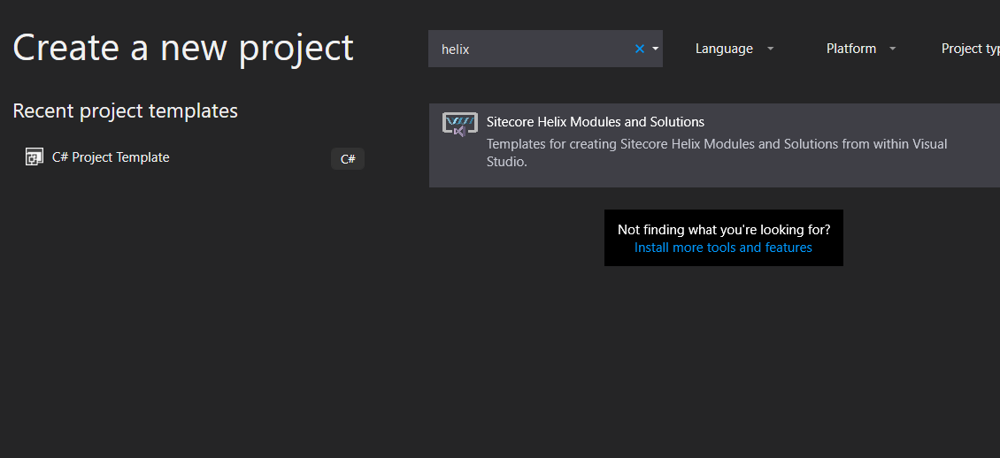
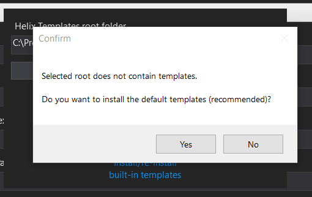
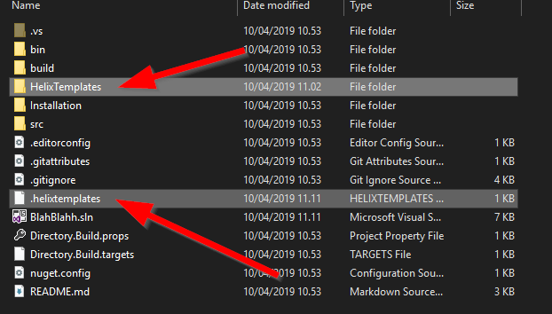
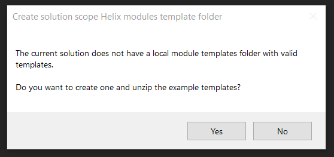
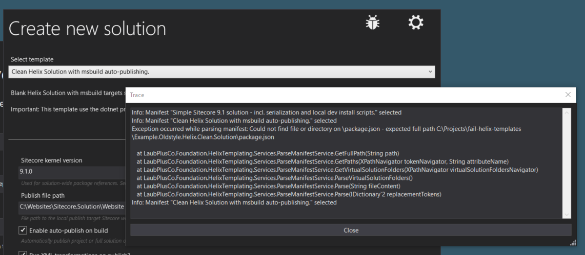

# Sitecore Helix Module & Solution Templates for VisualStudio

Visual Studio extension that accelerates creating new Visual Studio solutions and projects that follow the conventions described in Sitecore Helix.

**[Install extension from Visual Studio Marketplace](https://marketplace.visualstudio.com/items?itemName=AndersLaublaubplusco.SitecoreHelixVisualStudioTemplates)**

## Change log  

_2020-10-25 v20.10.2517_ 
(released)
- Bug fix of long paths issue when copying templates from within VS
- Manifest and setting dialogs can now be drag moved.
- Added extra GUID tokens that can be used for generating item yml
- Settings dialog updates
---

_2020-06-07 v20.06.0719_ 
(not released)
- Standard templates removed from this repo
- Bug fixing of new features
- Templates updated [here](https://github.com/LaubPlusCo/Helix-Templates) for templates. Please contribute.

---

_2020-02-18 v20.02.1722_ 
(not released)
- Changed versioning style.
- New feature; Simple conditional includes in templates.
- New feature: download templates online
- New feature: Token sections in manifest for better UI eXperience
- New feature: Enhanced Settings dialog, now show solution settings in separate tab and more.
- New feature: Display all preset VS tokens in tab.
- UI fixes and updates.
- Templates for Sitecore 9.3 - kept simple in ootb zip.  
    - See [this repository here!](https://github.com/LaubPlusCo/Helix-Templates) for templates. Please contribute.

---

_2020-01-12 v0.9.9.20_

- Bug fix; Proper TDS project support.
- Added New templates for Sitecore 9.3.

---

_2019-04-30 v0.9.9.14_

- Bug fix; relative folder path in .helixtemplates file fixed. Fix also allow templates on fileshare.
- Added Website.PublishSingleItem.targets to example solution templates.
  - [Read instructions here!](https://github.com/LaubPlusCo/helix-msbuild-example#getting-back-the-publish-item-command-in-solution-explorer)

---
_2019-04-26 v0.9.9.12_

- UI changes
  - Colors etc. now follow VS selected theme
  - Dialogs updated
  - New icons
  - New logo
- Trace window added to ease debugging templates
- Example templates
  - Bug fix: .user file not being loaded.
  - Change: renamed .props files to Website.* to reflect publish target instance role
- Added tags for VS 2019 Create dialog, not supported yet in VS2019 but should be soon.

---
_2019-04-10 v0.9.9.10_

- Added Visual Studio 2019 support
- Added relative module folder path support
  - To support solution module templates to be under source control.
- Various bug fixes
- New example templates added out-of-the-box
  - _See the Helix MS Build example [here](https://github.com/LaubPlusCo/helix-msbuild-example) to learn more about the new templates that are now shipped as examples with the extension._
- SkipAttach paths in manifest
  - enables setting up templates that include TDS projects

---

### Please submit bugs, ideas and enhancement suggestions using [Issues](https://github.com/LaubPlusCo/LaubPlusCo.Helix.VsTemplates/issues/)

## Installation

The extension can be installed via Visual Studio Extensions and Updates

Visual Studio 2015, 2017 and 2019 are supported but the built-in module templates does not support being loaded in Visual Studio 2015. You will need to make your own templates or upgrade VS.

> **Important Note:** You need to run Visual Studio as administrator to use this extension.  
> *Guide to always start Visual Studio as administrator*
> Right click a shortcut to Visual Studio 
>  
> - Select "Properties" 
> - Click "Open File Location"  
> - Right click "devenv.exe"  
> - Select "Troubleshoot compatibility"  
> - Select "Troubleshoot program"  
> - Check "The program requires additional permissions"  
> - Next, Test and Finish

When the extension has been installed a new project template is available under Visual C# templates.

In Visual Studio 2019 - Search for Helix to easily find the templates.

Using the template for the first time you will be asked to select a root directory for storing your Helix templates. This directory can be changed at any time from the Settings dialog. When an empty root folder is selected you will be asked if you want to install the built-in templates.

**New:** To keep your module templates under Source control you can add a solution-scope templates folder in your repo root. The extension will automatically try to detect if a folder exist and write a .helixtemplates configuration file with the relative folder path.

  

**New:** The extension will ask if you like to create a solution-scope module templates folder if none exist already. You can also manually create the folder or use the global-scope templates folder for modules.  

  

When selecting File > New Project the extension will presume that you are creating a new solution and filter the available templates so only solution templates are shown.

To add a new module click Add New project in the solution explorer. Note that you do not have to right-click the location you want the module placed. It is the template folder structure that dictates where the module is placed.

Always select the solution root folder when creating new modules. The template folder structure ensures that the module is placed correctly and will generate any missing folders.

## Debugging Templates

You can use the new trace window to debug your templates.  

  

If a template is not being loaded, open the trace window and then reload the template selection combo box by opening and closing the settings dialog.  _Note, the trace window is always top-most and has to be closed manually after creation is done._

## Footnotes

The included templates are only meant as examples - they can of course be used as is but please tailor the templates to match your customer solutions. Don't forget to think.

All code is released as open source under the ISC license.  
Please remember to include the original license in any derivatives.  
Anders Laub - contact@laubplusco.net